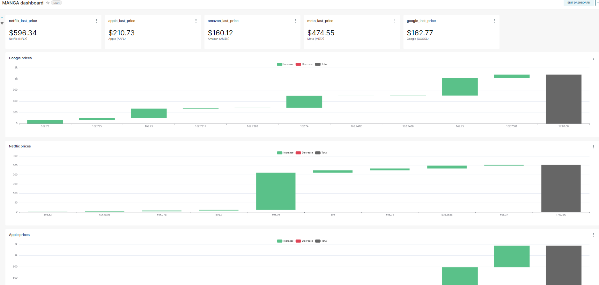

# manga-stock-prices

This is a simple pipeline project to extract data from a realtime system (finnhub websocket API), ingest in a kafka topic to consume and aggregate in a pyspark streaming process and ingest in an OTF table (delta lake) inside a blob storage (minio). After that, consume the data through a query engine (trino) and show some charts in a BI tool (superset).

The project uses MANGA stock price data.


## Pipeline

 

## Folder Structure

```markdown
├── README.md
├── assets           <- For resources like images and documents
├── docker           <- Docker images and volume configurations
|   └── config       <- Config files to mirror in volumes
|       ├── minio
│       └── trino              
├── source           <- Source code
|    ├── modules     <- Python modules with some pieces of code
│    └── scripts     <- General purpose scripts in python and sql   
```

---

## Services

- `Minio` - available on [http://localhost:9001](http://localhost:9001)
- `Superset` - available on [http://localhost:8088/](http://localhost:8088/)
- `Kafka UI` - available on [http://localhost:8080/](http://localhost:8080/)
- `Trino UI` - available on [http://localhost:8080/](http://localhost:8080/)


### Connections

- trino URI on superset connection: `trino://trino@trino:8080/hive`


## Launch the Project

Initialize container services
```bash
docker compose up -d
```

Start finnhub websocket API connection and send events to kafka broker
```bash
docker exec -it scripts python3 producer.py
```

Read events from kafka broker and insert into delta table
```bash
docker exec -it scripts python3 spark.py
```

Create a link to the delta table saved in minio
```bash
docker exec -it trino trino -f /etc/trino/init.sql
```

The dashboard will update automatically. ([http://localhost:8088/](http://localhost:8088/))

 